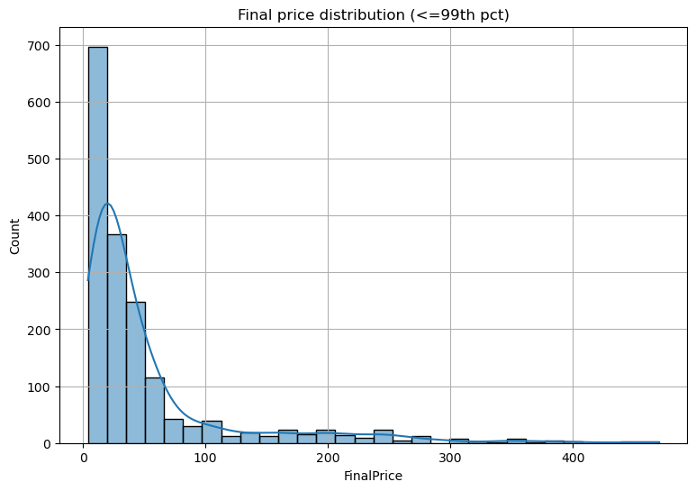
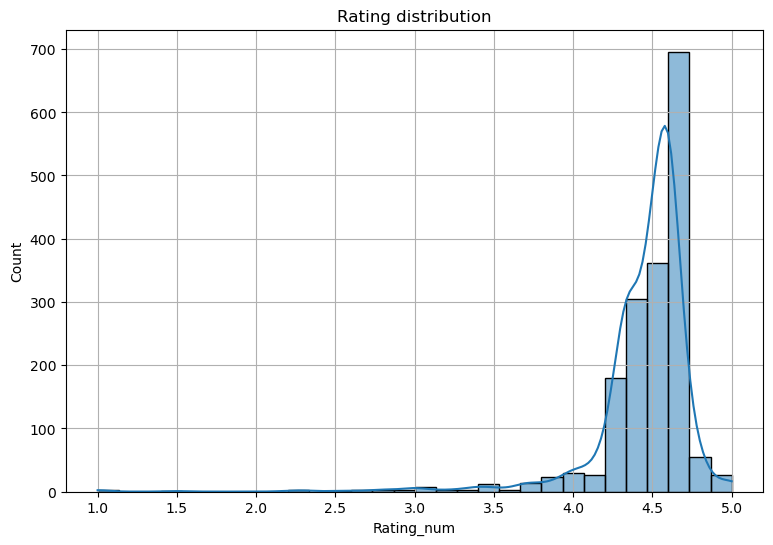
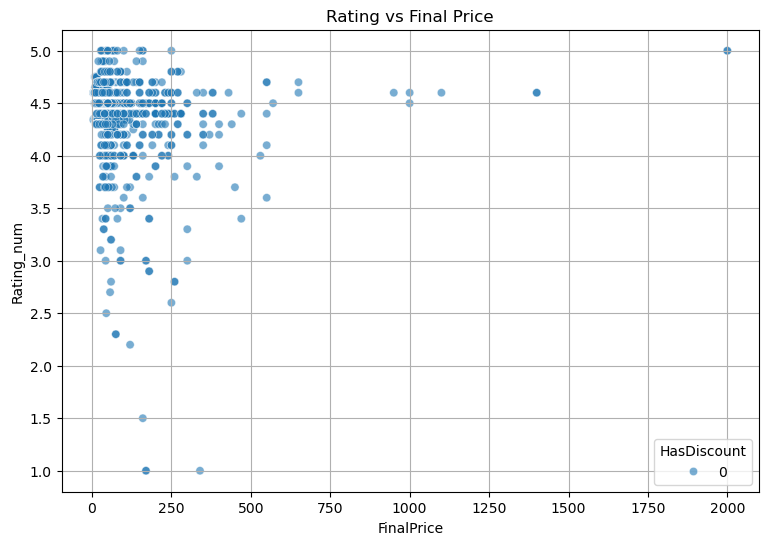
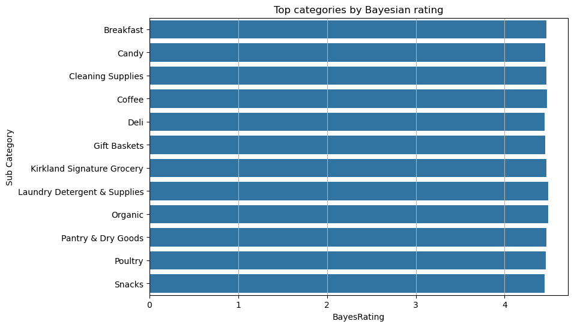
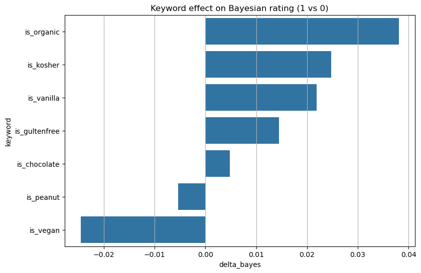

# 🛒 Grocery Products Data Analysis

## 📌 Project Overview :
This project analyzes a dataset of grocery products (≈1750 items) including prices, discounts, ratings, and product descriptions.  
The goal is to clean the data, engineer useful features, and extract **business insights** about product performance, pricing, and customer preferences.  

## ⚙️ Steps of Analysis :

### 1. Data Understanding :
- Dataset shape: `(1757, 8)`
- Columns: `Sub Category, Price, Discount, Rating, Title, Currency, Feature, Product Description`
- Missing values detected in:
  - `Price` (3 missing).
  - `Rating` (1075 missing).
  - `Title` (5 missing).
  - `Currency` (5 missing).
  - `Feature` (18 missing).
  - `Product Description` (42 missing).

### 2. Data Cleaning :
- Removed `$` sign and converted **Price** to numeric.  
- Extracted **numeric rating** and **review count** from Rating text.  
- Filled missing prices with **median by Sub Category** → fallback to overall median.  
- Standardized text features (lowercased, removed special characters).  
- Engineered `FinalPrice` (considering discount).  

### 3. Feature Engineering :
- **Bayesian Rating**: combines average rating with number of reviews for more robust ranking.  
- **Value Score**: normalized ratio of rating to price.  
- **Keyword Features**: extracted indicators like `is_organic`, `is_chocolate`, `is_kosher`, etc.  

### 4. Exploratory Data Analysis (EDA) :
Visualizations using **Matplotlib** and **Seaborn**:
- Distribution of product prices.
- Top subcategories by number of products.
- Rating vs Price scatter plot.
- Word frequency analysis in product titles.

---

### 5. Insights Summary :
Using both visual analysis and feature engineering, here are the compact business insights:

#### ✅ Top Categories by Bayesian Rating :
Laundry Detergent & Supplies 4.49
Organic 4.49
Coffee 4.48
Breakfast 4.47
Kirkland Signature Grocery 4.47

yaml

#### ✅ Best Value Products :
| Title | Category | Price | Reviews | Value Score | Bayes Rating |
|-------|----------|-------|---------|-------------|--------------|
| Namaste Gluten Free Waffle & Pancake Mix | Pantry & Dry Goods | 27.99 | 1 | 0.996 | 4.46 |
| Artstyle Paper Plate & Napkin Bundle | Paper & Plastic Products | 28.99 | 3 | 0.996 | 4.47 |
| Joyburst Energy Variety Pack | Beverages & Water | 32.99 | 1 | 0.995 | 4.46 |
| eat.art Salt and Spice Set | Gift Baskets | 44.99 | 3 | 0.994 | 4.47 |
| eat.art Salt and Spice Set | Pantry & Dry Goods | 44.99 | 3 | 0.994 | 4.47 |

#### ✅ Categories with Most Discounts :
Surprisingly, categories with **0% discounts** include:  
- Laundry Detergent & Supplies. 
- Deli.  
- Seafood. 
- Meat & Seafood.  
- Bakery & Desserts.  

This shows opportunity for promotions in these areas.  

#### ✅ Keywords Driving Positive Rating :
- `is_organic` (+0.038 on Bayesian rating)  
- `is_kosher` (+0.025)  
- `is_vanilla` (+0.022)  
- `is_glutenfree` (+0.015)  
- `is_chocolate` (+0.005)  

## 📊 Key Visuals :

### 1. Price Distribution
Shows the overall distribution of product prices.  

### 2. Rating Distribution
Highlights how ratings are spread across products.  

### 3. Rating vs Price
Scatterplot showing the relationship between product price and rating.  

### 4. Bayesian Rating by Category
Average Bayesian rating across categories.  
 

### 5. Keyword Impact on Bayesian Rating
Keywords that positively influence ratings.  

## 🚀 Conclusion :
- **Organic & coffee products** lead in customer satisfaction.  
- Some high-value products deliver excellent price-to-rating ratios.  
- Several categories show **no discounts**, leaving room for marketing promotions.  
- Organic, kosher, and gluten-free keywords are strong positive drivers for ratings.  

## 📂 Tech Stack :
- Python (Pandas, NumPy, Seaborn, Matplotlib)  
- Jupyter Notebook  

## 📢 Next Steps :
- Deeper text analysis on product descriptions.  
- Time-based pricing and seasonal trend analysis (if dates available).  
- Comparison with competitor datasets.
